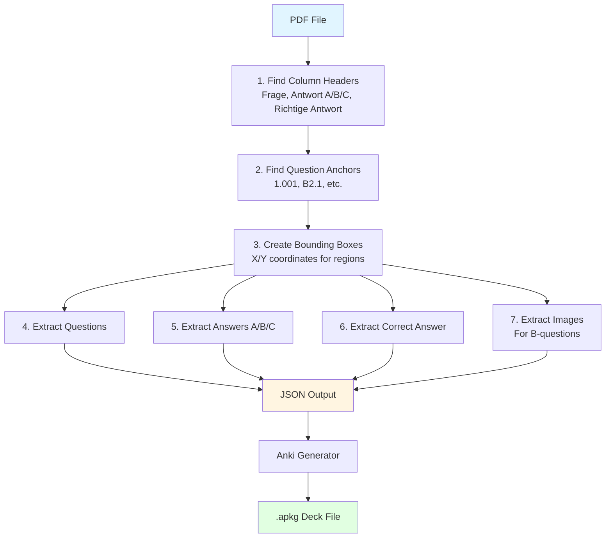

# Bavarian Fishing Exam Parser

Parser for Bavarian fishing exam questions with automatic Anki deck generation. 
It only works for `Pruefungsfragen_Fischerpruefung_2025_Stand-2024-12-19.pdf` (md5sum 
`ea48faea6b694c3208d6cea10610d6af`).
## Architecture Overview



**How it works:**
1. Scans PDF for column headers and question numbers
2. Uses X/Y coordinates to create bounding boxes
3. Extracts text and images from defined regions
4. Outputs structured JSON with Pydantic validation
5. Generates Anki cards with embedded images

## Installation

```bash
# Install uv (if not already installed)
curl -LsSf https://astral.sh/uv/install.sh | sh

# That's it! Scripts will auto-install dependencies when run
```

## Usage

### 1. Parse PDF

```bash
# Parse the exam PDF
uv run fishing_exam_parser.py --input Pruefungsfragen_Fischerpruefung_2025.pdf

# Test with first 10 pages only
uv run fishing_exam_parser.py --pages 10
```

**Output:**
- `fishing_exam_fsm.json` - All questions with answers
- `images/` - Directory with images for picture questions

### 2. Generate Anki Deck

```bash
uv run generate_anki_deck.py
```

**Output:**
- `fishing_exam.apkg` - Anki deck ready to import

## Known Limitations

- Only works with the specific PDF format of the Bavarian fishing exam
- Headers must be present on each page or on the first picture question page
- Picture questions must start with "B" (e.g., B2.1, B3.2)

## License

AGPL-3.0 
